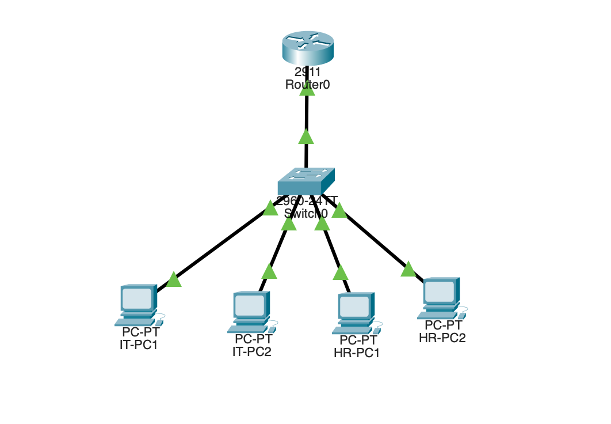
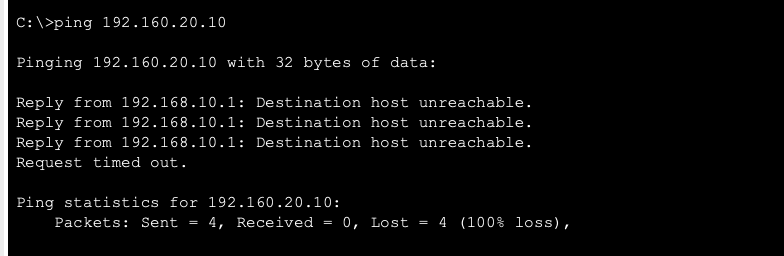

# small-business-network-lab

## Objective
Build and configure a simulated small-business network using Cisco Packet Tracer 

## Planned Features
- VLAN segmentation
- Inter-VLAN routing
- Static IP addressing
- Trunking
- Connectivity testing
- Network troubleshooting

## Technologies
- Cisco Packet Tracer
- Cisco IOS

## Network Topology

## Network Design

| Department | VLAN | Network | Default Gateway |
|---|---:|---|---|
| IT | 10 | 192.168.10.0/24 | 192.168.10.1 |
| HR | 20 | 192.168.20.0/24 | 192.168.20.1 |

## Devices
- Cisco 2911 Router
- Cisco 2960-24TT Switch
- 4 PCs
- Cisco Packet Tracer

## Configuration

### VLANs
- VLAN 10: IT
- VLAN 20: HR

### Switch Ports
- Fa0/1–Fa0/2 → VLAN 10
- Fa0/3–Fa0/4 → VLAN 20
- Gi0/1 → Trunk to Router

### Inter-VLAN Routing
Router-on-a-stick was configured using:

- GigabitEthernet0/0.10 → 192.168.10.1
- GigabitEthernet0/0.20 → 192.168.20.1

## Verification

The network was tested by pinging an HR workstation from an IT workstation.

The successful response confirms that inter-VLAN routing is functioning correctly.

## Troubleshooting

During configuration, I initially misspelled the `encapsulation dot1Q` command on the VLAN 20 subinterface.

This prevented the router from accepting an IP address on the subinterface.

I corrected the encapsulation configuration and verified the interface using:

`show ip interface brief`

## What I Learned
- How VLANs logically segment a switched network
- How access ports are assigned to VLANs
- How an 802.1Q trunk carries multiple VLANs
- How router subinterfaces provide routing between VLANs
- How default gateways allow hosts to communicate outside their subnet
- How to verify and troubleshoot Cisco configurations

## Future Improvements
- Configure DHCP
- Add additional departments/VLANs
- Implement ACLs
- Add network services
- Add redundancy
- Expand the network topology
